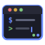

<p align="center">
  
</p>

<h1 align="center">websessions</h1>

<p align="center">
  <strong>A command center for managing multiple Claude Code CLI sessions.</strong><br>
  Launch, discover, monitor, and interact with all your sessions from one place.
</p>

<p align="center">
  <a href="https://github.com/IgorDeo/claude-websessions/releases/latest"></a>
  <a href="https://github.com/IgorDeo/claude-websessions/blob/main/LICENSE"></a>
  <a href="https://github.com/IgorDeo/claude-websessions/releases"></a>
</p>

<p align="center">
  <code>curl -LsSf https://raw.githubusercontent.com/IgorDeo/claude-websessions/main/install.sh | sh</code>
</p>

---

<!-- Screenshot placeholders — replace with actual screenshots -->
<!--
<p align="center">
  
</p>
-->

## Features

<table>
<tr>
<td width="50%">

**Terminal Management**
- Full interactive xterm.js terminals
- Split panes (horizontal/vertical)
- Tabs with drag-to-reorder
- Session rename, kill, restart

</td>
<td width="50%">

**Session Intelligence**
- Auto-discovers running Claude sessions
- Take over sessions from other terminals
- Resume previous conversations
- SQLite-backed session history

</td>
</tr>
<tr>
<td width="50%">

**Notifications**
- Real-time WebSocket push notifications
- Claude Code hooks integration
- Desktop notifications for completions, errors, tool approvals
- Configurable reminder intervals

</td>
<td width="50%">

**Developer Experience**
- Single binary, all assets embedded
- Native GUI mode (no browser needed)
- Git diff viewer per session
- Dark theme (Tokyo Night)
- Settings page with live config

</td>
</tr>
</table>

<!-- Screenshot placeholders — replace with actual screenshots -->
<!--
<details>
<summary>More screenshots</summary>

| Split Panes | Session Discovery | Notifications |
|:-----------:|:-----------------:|:-------------:|
|  |  |  |

| New Session | Settings | Git Diff |
|:-----------:|:--------:|:--------:|
|  |  |  |

</details>
-->

---

## Quick Start

```bash
# Install
curl -LsSf https://raw.githubusercontent.com/IgorDeo/claude-websessions/main/install.sh | sh

# Run
websessions
```

Open http://localhost:8080 — any running Claude Code sessions on your machine appear automatically.

> **Want a native window instead of a browser?** See [GUI mode](#gui-mode-no-browser-needed) below.

## Installation

### One-line install (recommended)

```bash
curl -LsSf https://raw.githubusercontent.com/IgorDeo/claude-websessions/main/install.sh | sh
```

Detects your OS/architecture, downloads the latest binary, and installs to `~/.local/bin` (or `/usr/local/bin` if writable). If GUI libraries (WebKit2GTK) are detected on your system, the GUI-enabled binary is installed automatically.

| Option | Description |
|--------|-------------|
| `WEBSESSIONS_VERSION=v0.7.0` | Pin a specific version |
| `WEBSESSIONS_INSTALL_DIR=/opt/bin` | Custom install path |
| `--no-gui` | Force standard binary even if GUI deps are available |

### Download binary manually

Grab the latest from [GitHub Releases](https://github.com/IgorDeo/claude-websessions/releases):

```bash
# Linux (amd64)
curl -L https://github.com/IgorDeo/claude-websessions/releases/latest/download/websessions-linux-amd64 -o websessions
chmod +x websessions && ./websessions

# macOS (Apple Silicon)
curl -L https://github.com/IgorDeo/claude-websessions/releases/latest/download/websessions-darwin-arm64 -o websessions
chmod +x websessions && ./websessions
```

### Build from source

```bash
git clone https://github.com/IgorDeo/claude-websessions.git
cd claude-websessions
mise run build
./bin/websessions
```

### Requirements

| Dependency | Required | Notes |
|-----------|----------|-------|
| **tmux** | Yes | Session management runtime |
| **Claude Code CLI** | Yes | `claude` command in PATH |
| **[mise](https://mise.jdx.dev/)** | For source builds/runs | Version manager and task runner used by `mise run ...` commands |
| **[Maple Mono Normal NF](https://github.com/subframe7536/maple-font)** | Recommended | Monospace font with ligatures and Nerd Font icons |
| **Go 1.26+** | Build only | Not needed for binary installs |
| **templ** | Build only | `go install github.com/a-h/templ/cmd/templ@latest` |

> **Font**: websessions uses [Maple Mono Normal NF](https://github.com/subframe7536/maple-font) as its preferred terminal font — a monospace font with round corners, ligatures, and Nerd Font icons. If not installed, it falls back to IBM Plex Mono, JetBrains Mono, Fira Code, or the system monospace font.

---

## Usage

### Creating a session

1. Click **+ New Session** in the footer or the **+** tab
2. Pick a **recent project** or type a working directory (autocomplete available)
3. Optionally select a previous Claude session to **resume**
4. Give it a name and an optional initial prompt
5. Click **Create** — the session opens automatically

### Session discovery & takeover

websessions scans for running `claude` processes on startup and periodically (default 30s). Discovered sessions appear in the sidebar with a **Take Over** button.

**Take Over** resolves the Claude session ID, kills the original terminal process, and launches `claude --resume` in a websessions-owned PTY — the conversation continues where it left off.

### Tabs and splits

| Action | How |
|--------|-----|
| Open session | Click in sidebar |
| Reorder tabs | Drag tabs |
| Create split | Drag tab to terminal edges |
| Tab context menu | Right-click tab |
| Close tab | Click x (session keeps running) |
| Split pane | Buttons in pane header |

### Notifications

Click the **bell icon** to see notifications. Events: session completed, errored, or waiting for input.

**Claude Code Hooks** (recommended): Go to **Settings > Claude Code Hooks > Install Hooks** to get more reliable notifications via `~/.claude/settings.json`.

### More actions

| Feature | How |
|---------|-----|
| Kill session | Right-click tab > Close & stop, or stop button in header |
| Rename session | Double-click name in pane header |
| Git diff | Click **&#916;** button in pane header |
| Session history | **History** tab in sidebar, with restart button |

---

## GUI Mode (no browser needed)

Run websessions in a native desktop window using the OS webview engine — lightweight and fast, no Chrome needed.

The installer **auto-detects** GUI libraries on your system. If they're present, the GUI-enabled binary is installed automatically — no extra flags needed. Just install the libs and run the installer:

| Platform | Install GUI libs, then re-run installer |
|----------|---------|
| Ubuntu/Debian | `sudo apt install libwebkit2gtk-4.1-0 libgtk-3-0` |
| Fedora | `sudo dnf install webkit2gtk4.1 gtk3` |
| Arch | `sudo pacman -S webkit2gtk-4.1 gtk3` |
| macOS | No extra deps (WebKit is built-in) |

```bash
# Install libs (example for Ubuntu), then install websessions
sudo apt install libwebkit2gtk-4.1-0 libgtk-3-0
curl -LsSf https://raw.githubusercontent.com/IgorDeo/claude-websessions/main/install.sh | sh

# Run with native window
websessions --gui
```

Closing the window shuts down the server gracefully.

### Build GUI from source

```bash
# Requires dev headers: sudo apt install libwebkit2gtk-4.1-dev libgtk-3-dev
mise run build-gui
./bin/websessions --gui
```

---

## Configuration

Config: `~/.websessions/config.yaml` (auto-created, or copy from `config.example.yaml`)

```yaml
server:
  port: 8080
  host: 0.0.0.0        # Use 127.0.0.1 to restrict to localhost

sessions:
  scan_interval: 30s    # How often to scan for new Claude processes
  output_buffer_size: 10MB  # Ring buffer size per session
  default_dir: ~/projects   # Default working directory for new sessions

notifications:
  desktop: true         # Enable browser desktop notifications
  events:               # Which events trigger notifications
    - completed
    - errored
    - waiting
```

All settings can also be changed from the **Settings** page in the UI.

---

## Build & Run

```bash
mise run build          # Build binary (runs templ generate)
mise run build-gui      # Build with native GUI support (requires CGO + system libs)
mise run run            # Build and run
mise run run-gui        # Build and run with native GUI window
mise run test           # Run all tests
mise run lint           # Run golangci-lint
mise run clean          # Remove build artifacts
```

```bash
./bin/websessions --config /path/to/config.yaml   # Custom config
./bin/websessions --log-level debug                # Debug logging
./bin/websessions --gui                            # Native window (GUI build only)
```

### Docker

```bash
docker build -t websessions .
docker run -p 8080:8080 websessions
```

> Docker mode can only manage sessions inside the container. For host sessions, run the binary directly.

---

## Architecture

```
cmd/websessions/          Entry point, signal handling, GUI launcher
internal/config/           YAML config loading with defaults
internal/store/            SQLite (pure Go) for session history and notifications
internal/session/          Session manager: PTY lifecycle, ring buffer, state machine
internal/discovery/        Process scanner (/proc on Linux, lsof on macOS), takeover
internal/notification/     Event bus with NotificationSink interface
internal/hooks/            Claude Code hooks installer for ~/.claude/settings.json
internal/service/          Background service (systemd on Linux, launchd on macOS)
internal/server/           chi router, htmx handlers, WebSocket streaming
web/templates/             Templ files (.templ) compiled to Go
web/static/                Vendored JS + CSS, embedded via go:embed
```

<details>
<summary>Dependencies</summary>

**Go packages**

| Package | Purpose |
|---------|---------|
| [chi](https://github.com/go-chi/chi) | HTTP router |
| [templ](https://github.com/a-h/templ) | Type-safe Go HTML templates |
| [gorilla/websocket](https://github.com/gorilla/websocket) | WebSocket connections |
| [creack/pty](https://github.com/creack/pty) | PTY allocation and management |
| [modernc.org/sqlite](https://pkg.go.dev/modernc.org/sqlite) | Pure Go SQLite driver (no CGO) |
| [yaml.v3](https://pkg.go.dev/gopkg.in/yaml.v3) | YAML config parsing |

**Vendored frontend (embedded, no npm)**

| Library | Version | Purpose |
|---------|---------|---------|
| [htmx](https://htmx.org/) | 2.0.4 | HTML-driven interactivity |
| [xterm.js](https://xtermjs.org/) | 5.5.0 | Web terminal emulator |
| [xterm-addon-fit](https://www.npmjs.com/package/@xterm/addon-fit) | 0.10.0 | Terminal auto-resize |
| [split.js](https://split.js.org/) | 1.6.5 | Resizable split panes |

</details>

<details>
<summary>Data storage</summary>

| What | Where |
|------|-------|
| Config | `~/.websessions/config.yaml` |
| Database | `~/.websessions/websessions.db` (SQLite) |
| Tab state | Browser localStorage |
| Sidebar order | Browser localStorage |

</details>

---

## Uninstall

```bash
curl -LsSf https://raw.githubusercontent.com/IgorDeo/claude-websessions/main/uninstall.sh | sh
```

Removes the binary, stops and removes any background service (systemd/launchd), and prompts before deleting your data (`~/.websessions/`).

---

## Development

```bash
mise run test                                                # All tests
go test ./internal/session/... -v -run TestManager_CreateSession  # Single test
go test ./internal/server/... -v -tags=integration           # Integration tests
templ generate                                               # Regenerate templates
mise run build && ./bin/websessions --log-level debug        # Debug run
```

## License

MIT
